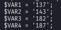

# Oefening 16

## Het pdf-bestand filteren

### Tussen welke lijnen moet je filteren?

Lijnen voor

```pdf
1.700 w
```

mogen weggelaten worden. De 1.700 in dit voorbeeld hoeft niet per se die waarde te hebben.

Daarnaast moeten lijnen na het keyword

```pdf
endstream
```

ook buiten beschouwing gelaten worden.

### Hoe ziet een coördinaat eruit?

Dit is een paragraafke. 1 paragraaf bevat **2** lijntjes. Opeenvolgende m & l lijnen zijn de corresponderende begin- en eindcoördinaat.

```pdf
q
140.500 168.143 m
140.500 124 l
140.500 124 m
184.643 124 l
S
Q
```

Hierbij zijn de m-lijnen steeds het begin van de coordinaat en l het einde. Het eerste cijfer is de x-coordinaat & het tweede cijfer de y-coordinaat.

## Verloop van de oefening

In eerste instantie zijn we niet geïnteresseerd in de volgorde van de lijnen. We gaan ze eerst allemaal overlopen om de waarden te "mappen".

### Het mappen zelf

We gaan alle mogelijke waarden in een hash steken met als key de waarde die we uit het bestand halen en als waarde de bijhorende mapping. Die mapping laten we beginnen met de waarde 0. Per verschillende waarde maken we hem twee groter.

### Na het mappen

Nu het mappen gebeurd is stellen we een tweedimensionale array op met daarin de juiste karakters voor het doolhof. Namelijk "|" en "-". Dit gebeurt door te kijken naar de begin- en eindcoordinaten. Zie de code voor meer :).

## Met kromme lijnen

Een blok ziet er nu zo uit:

```txt
q
143.107 739.393 m
162.571 739.393 162.571 744.607 182.036 744.607 c
137.893 700.464 m
162.571 700.464 162.571 695.250 187.250 695.250 c
S
Q
```

`m` blijft het beginpunt, `c` bevat echter elk punt in de bochten.
Het principe blijft dus bijna gelijk, alleen moeten we enkel
het laatste punt interpreteren van een clijn interpreteren.

Van deze lijn:

```
162.571 739.393 162.571 744.607 182.036 744.607 c
```

dus enkel `182.036 744.607`.

Om te bepalen of we een verticale of horizontale lijn moeten trekken
moeten we kijken welk van de twee coordinaten (x en y) het minst ver van
elkaar liggen:

```
begin : 143.107 739.393
einde:  182.036 744.607
```

744 en 739 liggen het dichtst bij elkaar ==> Dit zijn de y-waarden.
Bijgevolg gaat het hier om een horizontale lijn (want y blijft 'gelijk').

### Te veel x en y waarden

Een bijkomend probleem als we deze lijnen dan allemaal
uitlezen is dat er te veel waarden zijn voor het doolhof:



Dus we moeten een range inbouwen voor deze waarden zodat ze op hetzelfde gemapt
worden.
